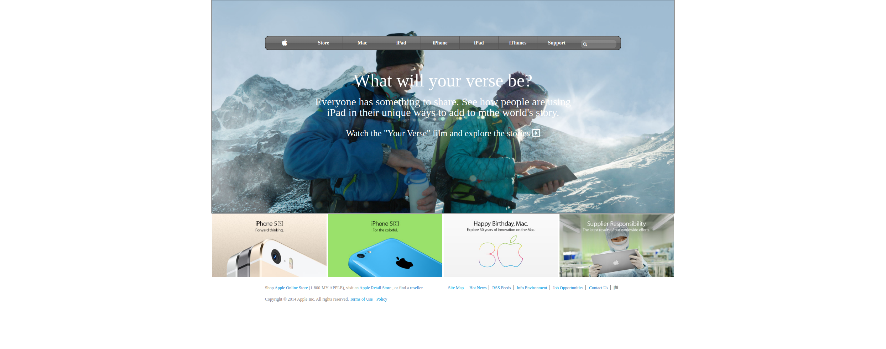

# Building-with-background-and-gradient

Fourth Microverse Project

Tiago and Grace's Building-with-background-and-gradient

Additional description about the project and its features.

This project was the second project compiled by Grace and Tiago in the Microverse HTML/CSS section of the course work. It involved cloning a apple page.The project contains a wrapper with a background image, a slide with images and a footer. The page contains a navBar with a special background gradient color.

## Built With

- HTML and CSS
- VScode 
- Windows10 and Ubuntu
- Webhint was used to validate the HTML code in this project
- Stylelint was used to validate the CSS code in this project

## Live Demo

[Live Demo Link](https://rawcdn.githack.com/GraceOyiza/Building-with-background-and-gradient/f83ad7aafae22a4fbe4c6ce31ce297e9cffd91d1/index.html)

## Getting Started

To get your own copy of our project clone the repository to your local machine.

## Authors

👤 **Grace Popoola**

- Github: [@GraceOyiza](https://github.com/GraceOyiza)

👤 **Tiago Alves**

- Github: [@tiagoes](https://github.com/tiagoes)

## 🤝 Contributing

Contributions, issues and feature

 ## Show your support
 Give a ⭐️ if you like this project!

## License
 This project is MIT licensed.